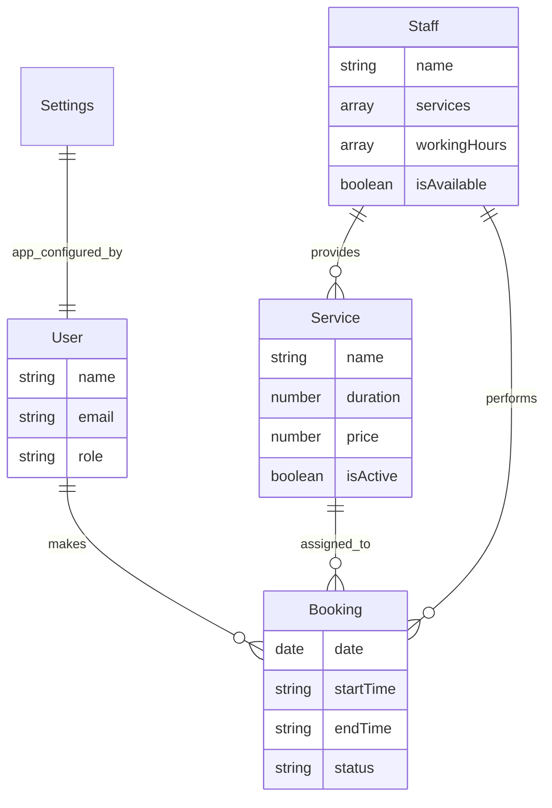

# ✨ Smart AI Assistant booking system for Hair Rap by Yoyo

Welcome to the next generation of salon management. This system is a high-performance, visually premium booking platform powered by a state-of-the-art **AI Intelligence Core**. Built for **Hair Rap by Yoyo**, it focuses on seamless operations, intuitive scheduling, and data-driven insights.

---

## 🚀 1. Setup & Environment Guide

### Prerequisites
- **Node.js**: v18+ 
- **MongoDB**: Local instance or Atlas URI
- **Gemini API Key**: From [aistudio.google.com](https://aistudio.google.com)

### Installation
```bash
# Clone the repository
git clone <repo-url>
cd BookEase

# Backend Setup
cd backend
npm install
cp .env.example .env  # Configure your URI and API keys
npm run seed          # Create default admin: admin@bookease.com / admin123
npm run dev

# Dashboard Setup
cd ../dashboard
npm install
npm run dev
```

---

## 📂 2. Folder Structure: The "Why" & "How"

We follow a clean **Controller-Service-Model** pattern to ensure the system remains organized and lightning-fast.

```text
backend/src/
├── config/      # Global constants, DB connection, & ENV management
├── controllers/ # HTTP Layer: Handles requests from the dashboard
├── middlewares/ # Security (Auth), Global Error Handling, & Validations
├── models/      # Database Layer: Where all your data lives
├── routes/      # Endpoint mapping (Admin access points)
├── services/    # Business Logic Layer: The system's heart and soul
├── utils/       # Shared patterns (Standardized responses and helpers)
└── validations/ # Strict data filters (ensures clean data)
```

### Why this is superior:
- **Modular Design**: Everything has its place. AI logic is separated from Booking logic, making updates safe and fast.
- **Predictable Success**: We use a unified `ApiResponse` utility for **EVERY** interaction.
- **Ironclad Reliability**: A global error handler prevents crashes and ensures the dashboard always stays online.

---

## 📊 3. System Architecture & Database

The system is built on a relational-like structure inside MongoDB to ensure 100% data integrity and high-performance joins.



---

## ⚙️ 4. The Booking Engine: Precision Scheduling

The core engine utilizes a **Check-Before-Write** strategy to ensure perfect schedule integrity and zero double-bookings.

### How it works:
1.  **Instant Validation**: Every request is screened for correct format and data integrity.
2.  **Entity Resolution**: The system verifies the Service and Staff availability in milliseconds.
3.  **Cross-Check Authorization**: Ensures the selected Staff is actually trained for the chosen Service.
4.  **Window Verification**: Automatically aligns with both Global Salon Hours and individual Staff Shifts.
5.  **Collision Shield**: Performs an atomic check against the database to ensure the time slot is free.
6.  **Atomic Creation**: Confirms the booking only when all conditions are 100% met.

---

## 🗓 5. Dynamic Slotting & Customer Experience

### Sliding Window Algorithm
Unlike static systems, we generate availability on-the-fly. This means if a staff member becomes available or a booking is moved, the dashboard reflects it **instantly**.

### Fair Cancellation Policy
- **Ownership Verification**: Customers can only manage their own bookings.
- **Enforced Windows**: Cancellation policies (e.g., 24-hour notice) are automatically calculated and enforced by the engine.

---

## 🤖 6. AI Intelligence Core: The Context-Injection Algorithm

This is the crown jewel of the system. We use a high-integrity **Hybrid RAG (Retrieval-Augmented Generation)** architecture to turn the AI into a powerful management partner.

### 🏗️ Modular AI Architecture
The AI logic is isolated for maximum security and speed at [backend/src/services/ai/](file:///Users/devHarish/vscode/test/backend/src/services/ai/):
- **[ai.service.js](file:///Users/devHarish/vscode/test/backend/src/services/ai.service.js)**: The brain that coordinates between the user and the database.
- **[ai.fetchers.js](file:///Users/devHarish/vscode/test/backend/src/services/ai/ai.fetchers.js)**: Features **"Smart Lookups"** that automatically resolve staff and service names with 100% accuracy.
- **[ai.intents.js](file:///Users/devHarish/vscode/test/backend/src/services/ai/ai.intents.js)**: Precisely understands user intent (e.g., "Show revenue," "Book haircut").
- **[ai.prompts.js](file:///Users/devHarish/vscode/test/backend/src/services/ai/ai.prompts.js)**: Enforces professional behavior and ensures the Dashboard receives clean HTML for a premium look.

### 🧠 Strategic Intelligence
- **Zero Hallucination**: The AI only speaks in terms of real data. It never "guesses" a number.
- **Auto-Formatting**: The system detects the context and switches formatting to match the Dashboard's aesthetic perfectly.
- **Quota Resilience**: Smart detection for API limits ensures the admin always knows what's happening.


## 🎨 Visual Identity
- **Palette**: High-Contrast **Black, White, and Blue**.
- **Aesthetic**: Premium SaaS feel with **Solid Surfaces** for maximum clarity.
- **Typography**: Strictly **Inter** for maximum legibility.

---

**Status**: Smart AI Integrated ✅ | Optimized for Hair Rap by Yoyo 🚀
