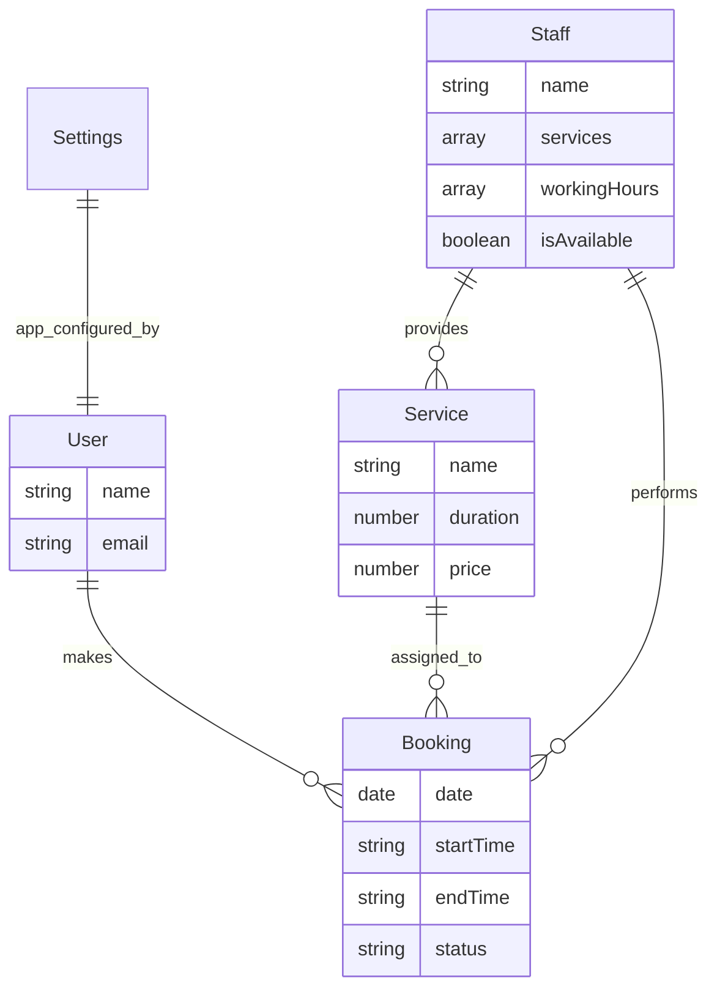

# ✨ Smart AI Assistant booking system for Hair Rap by Yoyo

Welcome to the next generation of salon management. This system is a high-performance, visually premium booking platform powered by a state-of-the-art **AI Intelligence Core**. Built for **Hair Rap by Yoyo**, it focuses on seamless operations, intuitive scheduling, and data-driven insights.

 **API Documentation**: [http://localhost:5005/api-docs/#/](http://localhost:5005/api-docs/#/)

---

##  1. AI Intelligence Core: The Context-Injection Algorithm

The crown jewel of the system. We use a high-integrity **Hybrid RAG (Retrieval-Augmented Generation)** architecture to turn the AI into a powerful management partner.

###  Modular AI Architecture
The AI logic is isolated for maximum security and speed:
- **Intelligent Brain**: Coordinates between the user and the database with high precision.
- **Smart Lookups**: Automatically resolves staff and service names with 100% accuracy.
- **Intent Detection**: Precisely understands user intent (e.g., "Show revenue," "Book haircut").
- **Professional Persona**: Enforces business-standard behavior and premium UI formatting.

###  Strategic Intelligence
- **Zero Hallucination**: The AI only speaks in terms of real-time verified data.
- **Auto-Formatting**: Dynamically matches the Dashboard's aesthetic.
- **Quota Resilience**: Smart detection for API limits ensures continuous operation.

---

##  2. The Booking Logic: Simple & Secure

The system utilizes advanced scheduling algorithms to ensure salon operations run without conflicts.

###  Dynamic Availability Search
When searching for a service on a specific date:
1.  **Staff Filtering**: Identifies staff qualified for the service and scheduled for that day.
2.  **Sliding Window**: Calculates availability by "sliding" the service duration through the stylist's shift in 15-minute increments.
3.  **Conflict Detection**: Every time slot is checked against existing "Confirmed" or "Pending" bookings in real-time.

### Atomic Booking Confirmation
Even after picking a slot, the system employs a final "Collision Shield":
1.  **Final Verification**: Re-checks stylist availability at the millisecond of booking.
2.  **Concurrency Management**: Ensures no two customers can ever claim the same slot simultaneously.

---

##  3. System Architecture & Tech Stack

### Database Schema
Built on a relational-like structure inside MongoDB for 100% data integrity.



### Technical Blueprints
For a deep dive into the system's structural and logical design, refer to our detailed diagrams:
- [ER Diagram](file:///Users/devHarish/vscode/test/docs/ER_DIAGRAM.md) — Database relationships and constraints.
- [Class Diagram](file:///Users/devHarish/vscode/test/docs/CLASS_DIAGRAM.md) — Service-layer architecture and inheritance.
- [Flow Diagram](file:///Users/devHarish/vscode/test/docs/FLOW_DIAGRAM.md) — Step-by-step logic for bookings and AI.

### Folder Structure
We follow a clean **Controller-Service-Model** pattern for modularity and speed.

```text
backend/src/
├── controllers/ # HTTP Layer: Handles Dashboard requests
├── services/    # Business Logic: The core engine
├── models/      # Database Layer
├── routes/      # API Endpoints
├── middlewares/ # Security & Global Error Handling
└── utils/       # Shared Helpers & API Patterns
```

---

## 

The system is designed with **Future-Proofing** as a core priority. We follow strict architectural patterns to ensure the code remains clean, maintainable, and highly scalable.

###  Decoupled Architecture
- **Isolated Features**: Each feature (AI, Bookings, Analytics) is self-contained. Modifying the AI prompt logic will never break the core booking engine.
- **Zero-Side-Effect Policy**: Changes are scoped to their specific modules, ensuring that upgrades are safe and predictable.

### ⚡ Separation of Concerns (SoC)
We strictly separate the **"What"** from the **"How"**:
- **Handler Functions**: Dedicated handlers manage specific tasks (e.g., `aiChat`, `createBooking`), keeping the controller layer thin and readable.
- **Utility Layer**: Common logic (date formatting, query parsing, standardized responses) is abstracted into a robust `utils` library.
- **Service Layer**: All business logic lives in the services, away from the HTTP transport layer, making it easy to test and replace.

###  Future-Ready Scaling
- **Modular Data Access**: New database fields or entire collections can be added without rewriting existing service logic.
- **Plug-and-Play Components**: Both the Dashboard and Backend are built with a "component-first" mindset, making it trivial to add new features or upgrade existing ones without service interruption.

---

##  5. Best Practices Infrastructure

###  Interactive Swagger Documentation
Live environment to test every endpoint with standardized requests.
- **Implementation**: Powered by `swagger-jsdoc` and `swagger-ui-express`.
- **URL**: [http://localhost:5005/api-docs](http://localhost:5005/api-docs)

###  Professional Logging System
The backend utilizes **Winston** for industrial-grade tracking.
- **Development**: Colorized console output for instant debugging.
- **Production**: Critical errors are persisted to `logs/error.log`.

---

##  6. Setup & Environment Guide

### Prerequisites
- **Node.js**: v18+ 
- **MongoDB**: Local or Atlas instance
- **Gemini API Key**: From [aistudio.google.com](https://aistudio.google.com)

### Installation
```bash
# Backend Setup
cd backend
npm install
cp .env.example .env  # Configure your keys
npm run seed          # Default admin: admin@hairrapbyyoyo.com / admin123
npm run dev

# Dashboard Setup
cd ../dashboard
npm install
npm run dev
```

---

##  Visual Identity
- **Palette**: High-Contrast **Black, White, and Blue**.
- **Aesthetic**: Premium SaaS feel with **Solid Surfaces**.
- **Typography**: Strictly **Inter** for maximum legibility.

---

**Status**: Smart AI Integrated  | Optimized for Hair Rap by Yoyo 
