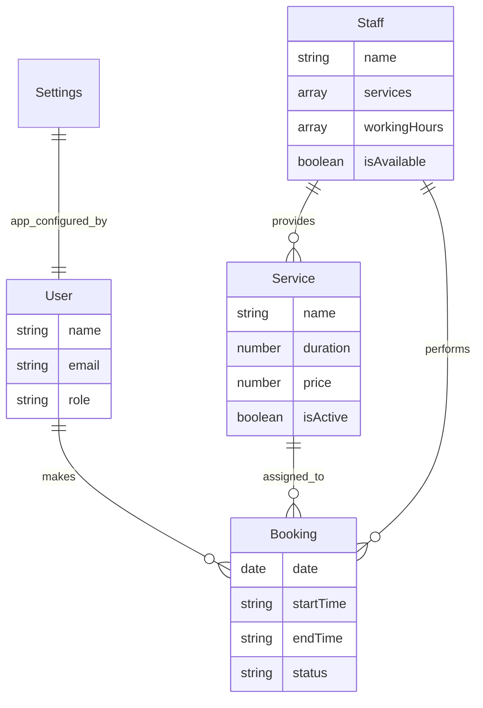
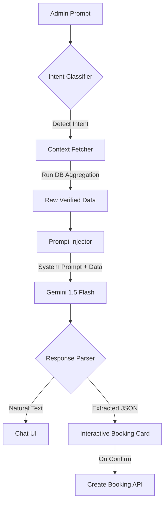

# BookEase — Production-Grade Booking Platform

Welcome to **BookEase**, a high-performance, visually premium booking platform. This project is built with a focus on **Engineering Excellence**, scalable architecture, and a "Zero-Failure" philosophy for both the backend and administrative dashboard.

---

## 🚀 1. Setup & Environment Guide

### Prerequisites
- **Node.js**: v18+ (tested on v20.x)
- **MongoDB**: Local instance or Atlas URI
- **Gemini API Key**: From [aistudio.google.com](https://aistudio.google.com)

### Installation
```bash
# Clone the repository
git clone <repo-url>
cd BookEase

# Backend Setup
cd backend
npm install
cp .env.example .env  # Configure your URI and API keys
npm run seed          # Create default admin: admin@bookease.com / admin123
npm run dev

# Dashboard Setup
cd ../dashboard
npm install
npm run dev
```

---

## 📂 2. Folder Structure: The "Why" & "How"

We follow a strict **Controller-Service-Model** pattern to ensure the codebase remains maintainable as it scales.

```text
backend/src/
├── config/      # Global constants, DB connection, & ENV management
├── controllers/ # HTTP Layer: Handles requests, parses params, sends responses
├── middlewares/ # Security (Auth), Global Error Handling, & Zod Validations
├── models/      # Database Layer: Mongoose Schema definitions
├── routes/      # Endpoint mapping (Admin routes isolated)
├── services/    # Business Logic Layer: The "Brain" (Calculations & DB ops)
├── utils/       # Shared patterns (ApiResponse, ApiError, Date helpers)
└── validations/ # Strict request schemas (Zod)
```

### Why this is good:
- **Separation of Concerns**: Controllers only handle HTTP; Services handles the logic. This makes testing individually simple.
- **Predictable Responses**: We use a unified `ApiResponse` utility for **EVERY** endpoint.
  - **Standard Format:**
    ```json
    {
      "success": true,
      "statusCode": 200,
      "message": "Description",
      "data": { ... },
      "meta": { "total": 100, "page": 1 }
    }
    ```
- **Centralized Error Handling**: A global middleware catches all `ApiError` instances, preventing server crashes and ensuring professional responses even during failures.
- **Strict Validation**: We use **Zod** schema validation at the door (middleware layer) so invalid data never reaches the controllers.

---

## 📊 3. Project Structural & Database Relationships

BookEase is built on a relational-like structure inside MongoDB to ensure data integrity and high-performance joins (via `$lookup`).



**Scalable Logic**: By using references (`staffId`, `serviceId`) and populated query results, we maintain a strict "Source of Truth" for all availability calculations.

---

## ⚙️ 4. API Algorithm: Professional Booking Flow (`POST /bookings`)

The Booking Engine utilizes a **Check-Before-Write** strategy to ensure 100% schedule integrity and prevent race conditions.

### Algorithm Steps:
1.  **Input Parsing**: Receive `serviceId`, `staffId`, `date`, and `startTime` from the client.
2.  **Schema Validation**: Execute **Zod Interceptor**. Validate field types, date formats, and ID integrity. Reject with `400 Bad Request` if invalid.
3.  **Entity Resolution**: Fetch `Service` and `Staff` documents in parallel (`Promise.all`).
    *   *Exit Case*: If either entity is missing or inactive, throw `404 Not Found`.
4.  **Authorization Check**: Verify that `serviceId` exists within the `staff.services` array.
    *   *Exit Case*: If staff is not trained for this service, throw `400 Forbidden`.
5.  **Time Computation**: 
    - Convert `startTime` to `startMinutes` (e.g., "10:30" → 630).
    - Add `service.duration` to `startMinutes` to calculate `endMinutes`.
    - Format `endMinutes` back to `HH:mm` string (`endTime`).
6.  **Operational Window Verification**: 
    - Map `date` to a day name (e.g., "Monday").
    - Fetch **Global Salon Hours** from `AppSettings`.
    - Find matching **Staff Working Hours** for the day.
    - **Intersection Check**: Ensure `[startMinutes, endMinutes]` is fully contained within the intersection of Global and Staff working windows.
    *   *Exit Case*: If outside the window, throw `400 Out of Hours`.
7.  **Collision Shield (Atomic Check)**: Query `Bookings` collection for any non-cancelled records for the same staff and date where:
    - `startTime < newBooking.endTime` **AND** `endTime > newBooking.startTime`.
    *   *Exit Case*: If an overlap is found, throw `409 Conflict` (Slot taken).
8.  **Record Creation**: Atomically create the `Booking` document with `status: "pending"`.
9.  **Response**: Return the fully populated document to the frontend.

---

## 🗓 5. API Algorithm: Dynamic Slotting & Cancellation

### Dynamic Slotting Algorithm (`GET /availability`)
Unlike static systems, we generate availability on-the-fly using a **Sliding Window Algorithm**.

1.  **Fetch Constraints**: Load Service duration, active Staff who provide the service, and Global Salon settings.
2.  **Fetch Obstacles**: Retrieve all non-cancelled bookings for all eligible staff on the target date.
3.  **Window Iteration**: For each staff member:
    - Determine their `effectiveShift` (Intersection of Staff vs. Global hours).
    - Initialize `pointer` = `effectiveStart`.
    - While `pointer + serviceDuration <= effectiveEnd`:
        - **Collision Check**: Check if the current `[pointer, pointer + duration]` window overlaps with any existing bookings for this staff member.
        - **Result**: 
            - If **no overlap**: Push a virtual "Available Slot" to the result set.
            - **Slider**: Increment `pointer` by 15-minute intervals.
4.  **Serialization**: Sort the aggregate list of virtual slots by `startTime` and return.

### Cancellation & Refund Policy Algorithm (`PATCH /:id/cancel`)
1.  **Ownership Check**: Validate that the `bookingId` belongs to the requesting `userId`.
2.  **Status Check**: Verify the current state.
    *   *Exit Case*: If already `cancelled`, throw `400`.
3.  **Policy Enforcement**:
    - If status is `confirmed`, fetch `cancellationWindowHours` from settings.
    - Calculate `Delta` = `AppointmentStartTime - CurrentTime`.
    - If `Delta < PolicyWindow`, throw `403 Forbidden` (Too late to cancel).
4.  **State Mutation**: Update status to `cancelled` and record `cancelledBy: "customer"`.

---

## 🤖 6. AI Intelligence Core: The Context-Injection Algorithm

BookEase does not use static, hallucination-prone AI. We implement a **Hybrid RAG (Retrieval-Augmented Generation)** approach that treats the AI as a secure execution layer over our database.

### The Full End-to-End Flow:



### 1. Intent Recognition & Keyword Mapping
Every query is first analyzed by our `detectIntent` engine. Using a combination of strict keyword mapping (`src/services/ai.service.js:INTENT_MAP`) and LLM classification, we identify exactly what the admin needs (e.g., `revenue`, `upcoming_bookings`, or `book_appointment`).

### 2. Dynamic Context Retrieval
Once an intent is locked, the system triggers a specialized **Context Fetcher**.
- **Example (Revenue)**: The system doesn't ask the AI to calculate totals. Instead, it runs a complex **MongoDB Aggregation Pipeline** to sum up confirmed booking prices directly from the database.
- **Example (Booking)**: To prevent ID errors, the fetcher retrieves a list of *Active Services*, *Available Staff*, and *Recent Customers*, providing their exact Database IDs to the AI.

### 3. Prompt Engineering & Injection
The `SYSTEM_PROMPT` enforces strict operational rules:
- **Zero Hallucination**: "Only use the data provided. Don't make things up."
- **Strict Formatting**: Rules for currency symbols, sentence limits, and JSON structures.
- **Context Sandwich**: The AI receives the System Prompt, then the **Raw Database JSON**, and finally the user's query.

### 4. Interactive Response Parsing
Unlike a standard chatbot, our backend parses the AI's response for structured data:
- **Regex Extraction**: We use regex to pull valid JSON blocks from the AI's natural language response.
- **Frontend Hydration**: In the `AiPopup.jsx` component, if the AI includes `extracted` data, the UI dynamically switches from a simple bubble to an **Interactive Booking Card**, allowing the admin to create real appointments with a single click.

### 5. Why this is superior:
- **Data Integrity**: The AI never "guesses" a number; it only interprets real DB results.
- **Security**: The AI is never given full DB access; it only sees the specific "Context Window" fetched for that query.
- **Conversion focus**: The flow from "Chat" to "Booking Card" to "Database Entry" transforms the AI from a search tool into a functional operation engine.

---

## 🎨 Visual Identity
- **Palette**: High-Contrast **Black, White, and Blue**.
- **Aesthetic**: Modern SaaS feel with **Solid Surfaces** (clarity over transparency/glassmorphism).
- **Typography**: Strictly **Inter** for maximum legibility on high-density dashboards.

---

**Status**: Production Ready ✅ | Documented for Professional Scale 🚀
# assignment_hair_rap_by_yoyo
