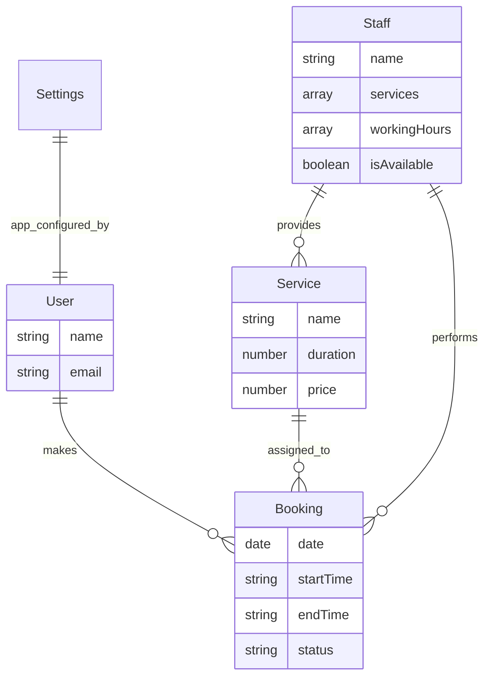

# ✨ Smart AI Assistant booking system for Hair Rap by Yoyo

Welcome to the next generation of salon management. This system is a high-performance, visually premium booking platform powered by a state-of-the-art **AI Intelligence Core**. Built for **Hair Rap by Yoyo**, it focuses on seamless operations, intuitive scheduling, and data-driven insights.

 **API Documentation**: [http://localhost:5005/api-docs/#/](http://localhost:5005/api-docs/#/)

---

##  1. AI Intelligence Core: The Context-Injection Algorithm

The crown jewel of the system. We use a high-integrity **Hybrid RAG (Retrieval-Augmented Generation)** architecture to turn the AI into a powerful management partner.

###  Modular AI Architecture
The AI logic is isolated for maximum security and speed:
- **Intelligent Brain**: Coordinates between the user and the database with high precision.
- **Smart Lookups**: Automatically resolves staff and service names with 100% accuracy.
- **Intent Detection**: Precisely understands user intent (e.g., "Show revenue," "Book haircut").
- **Professional Persona**: Enforces business-standard behavior and premium UI formatting.

###  Strategic Intelligence
- **Zero Hallucination**: The AI only speaks in terms of real-time verified data.
- **Auto-Formatting**: Dynamically matches the Dashboard's aesthetic.
- **Quota Resilience**: Smart detection for API limits ensures continuous operation.

---

##  2. Standard Professional API Logic

Our system uses industrial-grade logic to handle bookings perfectly. Here is how our 3 main APIs work in simple steps:

### A. Availability API (Find Free Time)
*Goal: To show customers exactly when a stylist is free for a specific service.*

1.  **Staff & Shift Check**: First, the system checks if the stylist actually works on that day and what their shift hours are (e.g., 10:00 AM to 7:00 PM).
2.  **The "Sliding Window" Search**: The system takes the service length (e.g., a 45-minute haircut) and "slides" it through the stylist's shift in 15-minute jumps.
3.  **Conflict Detection**: At every jump, it looks at the database to see if there is already a "Confirmed" booking that overlaps.
4.  **Result**: It only shows the times where the "Window" is completely empty and fits perfectly within the stylist's working hours.

### B. Post Booking API (Create an Appointment)
*Goal: To save a new booking safely without any double-bookings.*

1.  **Operational Guard**: It re-verifies that the service and stylist are still active in the salon.
2.  **The "Collision Shield"**: Even if the customer saw the slot as free 1 minute ago, the system does a final check at the **exact millisecond** of the request to ensure no one else squeezed in.
3.  **Data Integrity (Atomic Check)**: We use a special database rule (Unique Index) that acts like a "Physical Lock." If two people try to book the same spot at the same time, the database allows only the first one and rejects the second.
4.  **Database Transactions**: This is like a "Single Contract." Either every part of the booking is saved (the slot is blocked and the booking is created), or **nothing** is saved. This prevents "half-saved" data if the server crashes.

### C. Cancel Booking API (Cancel an Appointment)
*Goal: To let users cancel while protecting the salon's schedule.*

1.  **Ownership Verification**: The system ensures only the person who made the booking (or an admin) can cancel it.
2.  **The "Fair-Play" Window**: It checks the salon's rules. For example, you might need to cancel at least 2 hours before the appointment. If it's too late, the cancellation is rejected.
3.  **Status Update**: Once approved, the system updates the booking status to "Cancelled" and immediately releases the time slot so another customer can book it.

---

##  3. System Architecture & Tech Stack

### Database Schema
Built on a relational-like structure inside MongoDB for 100% data integrity.



### Technical Blueprints
For a deep dive into the system's structural and logical design, refer to our detailed diagrams:
- [ER Diagram](file:///Users/devHarish/vscode/test/docs/ER_DIAGRAM.md) — Database relationships and constraints.
- [Class Diagram](file:///Users/devHarish/vscode/test/docs/CLASS_DIAGRAM.md) — Service-layer architecture and inheritance.
- [Flow Diagram](file:///Users/devHarish/vscode/test/docs/FLOW_DIAGRAM.md) — Step-by-step logic for bookings and AI.

### Folder Structure
We follow a clean **Controller-Service-Model** pattern for modularity and speed.

```text
backend/src/
├── controllers/ # HTTP Layer: Handles Dashboard requests
├── services/    # Business Logic: The core engine
├── models/      # Database Layer
├── routes/      # API Endpoints
├── middlewares/ # Security & Global Error Handling
└── utils/       # Shared Helpers & API Patterns
```

---

## 

The system is designed with **Future-Proofing** as a core priority. We follow strict architectural patterns to ensure the code remains clean, maintainable, and highly scalable.

###  Decoupled Architecture
- **Isolated Features**: Each feature (AI, Bookings, Analytics) is self-contained. Modifying the AI prompt logic will never break the core booking engine.
- **Zero-Side-Effect Policy**: Changes are scoped to their specific modules, ensuring that upgrades are safe and predictable.

### ⚡ Separation of Concerns (SoC)
We strictly separate the **"What"** from the **"How"**:
- **Handler Functions**: Dedicated handlers manage specific tasks (e.g., `aiChat`, `createBooking`), keeping the controller layer thin and readable.
- **Utility Layer**: Common logic (date formatting, query parsing, standardized responses) is abstracted into a robust `utils` library.
- **Service Layer**: All business logic lives in the services, away from the HTTP transport layer, making it easy to test and replace.

###  Future-Ready Scaling
- **Modular Data Access**: New database fields or entire collections can be added without rewriting existing service logic.
- **Plug-and-Play Components**: Both the Dashboard and Backend are built with a "component-first" mindset, making it trivial to add new features or upgrade existing ones without service interruption.

---

##  5. Best Practices Infrastructure

###  Interactive Swagger Documentation
Live environment to test every endpoint with standardized requests.
- **Implementation**: Powered by `swagger-jsdoc` and `swagger-ui-express`.
- **URL**: [http://localhost:5005/api-docs](http://localhost:5005/api-docs)

###  Professional Logging System
The backend utilizes **Winston** for industrial-grade tracking.
- **Development**: Colorized console output for instant debugging.
- **Production**: Critical errors are persisted to `logs/error.log`.

---

##  6. Setup & Environment Guide

### Prerequisites
- **Node.js**: v18+ 
- **MongoDB**: Local or Atlas instance
- **Gemini API Key**: From [aistudio.google.com](https://aistudio.google.com)

### Installation
```bash
# Backend Setup
cd backend
npm install
cp .env.example .env  # Configure your keys
npm run seed          # Default admin: admin@hairrapbyyoyo.com / admin123
npm run dev

# Dashboard Setup
cd ../dashboard
npm install
npm run dev
```

---

##  Visual Identity
- **Palette**: High-Contrast **Black, White, and Blue**.
- **Aesthetic**: Premium SaaS feel with **Solid Surfaces**.
- **Typography**: Strictly **Inter** for maximum legibility.

---

**Status**: Smart AI Integrated  | Optimized for Hair Rap by Yoyo 
