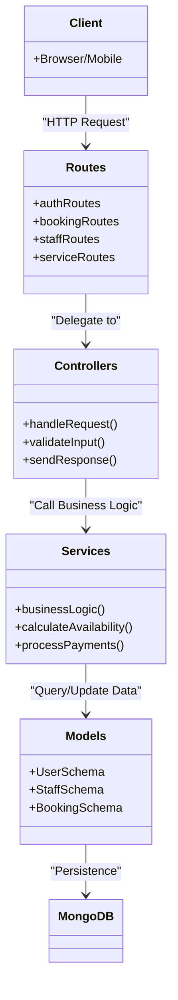

# Class / Architectural Diagram

HairRapByYoyo follows a **Layered Architecture** pattern in the backend to ensure separation of concerns, testability, and maintainability.

## Architectural Layers

## Layer Explanations

### 🛤️ Routes (`src/routes`)
- **Responsibility**: Defining the API endpoints and attaching necessary middleware (Auth, Validation).
- **Tags**: #EntryPoints #Routing

### 🎮 Controllers (`src/controllers`)
- **Responsibility**: Handling the HTTP lifecycle. It parses parameters, calls the appropriate service, and formats the JSON response.
- **Tags**: #RequestHandling #InputParsing

### 🧠 Services (`src/services`)
- **Responsibility**: The heart of the application. All business logic, third-party integrations (AI, Email), and complex calculations (Slotting) reside here.
- **Tags**: #BusinessLogic #HeavyLifting #Calculations

### 💾 Models (`src/models`)
- **Responsibility**: Defining the data structure and schema constraints using Mongoose.
- **Tags**: #DataSchema #Validation #Persistence

## Vertical Slice Example: Booking Creation
1. **Route**: `POST /api/bookings`
2. **Controller**: `bookingController.createBooking`
3. **Service**: `bookingService.processNewBooking`
4. **Model**: `Booking.save()`
