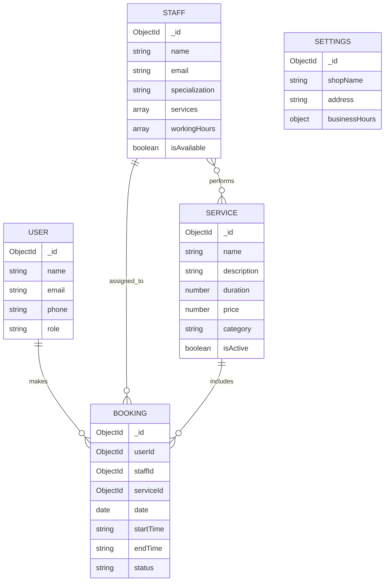

# Entity Relationship (ER) Diagram

This document outlines the database schema and relationships for the BookEase system. The system uses MongoDB with Mongoose, following a relational-like structure for bookings and staff management.

## Diagram

## Entity Explanations

### 👤 User
- **Description**: Represents the customers and potentially administrators of the platform.
- **Key Fields**: `email` (unique identifier for login), `role` (defines permissions).

### ✂️ Staff
- **Description**: The service providers (stylists/doctors/etc.).
- **Key Relationships**: 
    - Links to multiple `Services` they are qualified to perform.
    - Contains `workingHours` which the `SlotService` uses to calculate availability.

### 💄 Service
- **Description**: The individual offerings provided by the business.
- **Key Fields**: `duration` (critical for calculating booking slots), `price`.

### 📅 Booking
- **Description**: The central entity connecting Users, Staff, and Services.
- **Key Logic**: 
    - Uses `startTime` and `endTime` as strings (e.g., "14:00") for easier frontend display and calculation.
    - `status` manages the lifecycle (PENDING, CONFIRMED, CANCELLED).

### ⚙️ Settings
- **Description**: Global configuration for the business, including shop name and general business hours.
