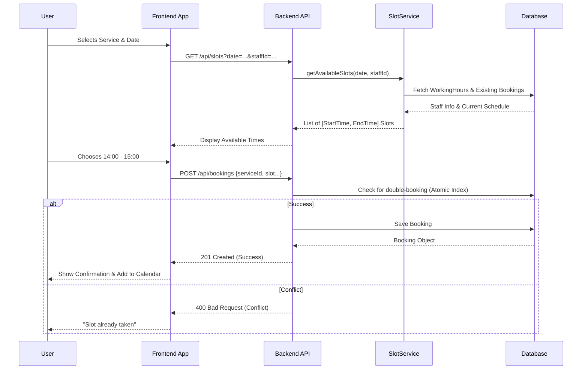

# Core Flow Diagram: Booking Creation

This diagram illustrates the end-to-end flow of a user booking an appointment, highlighting the interaction between the frontend, availability logic, and data persistence.

## Flowchart

## Key Step Explanations

### 1. Dynamic Availability Check
Unlike static slot systems, BookEase calculates availability on the fly. The **SlotService** looks at the staff member's defined working hours for that specific day and subtracts any existing bookings to present a clean list of free time.

### 2. Conflict Prevention
The system uses a **Compound Unique Index** in MongoDB on `{ staffId, date, startTime }` to ensure that even if two users click "Book" at the exact same millisecond, the database handles the race condition and only allows one to succeed.

### 3. Service Duration Matching
When a user selects a service, the slots shown are filtered to ensure they are long enough to accommodate the service's `duration` (e.g., a 60-min haircut needs a 60-min gap).

## Tags
 #UserFlow #BookingLifecycle #AtomicOperations #AvailabilityLogic
